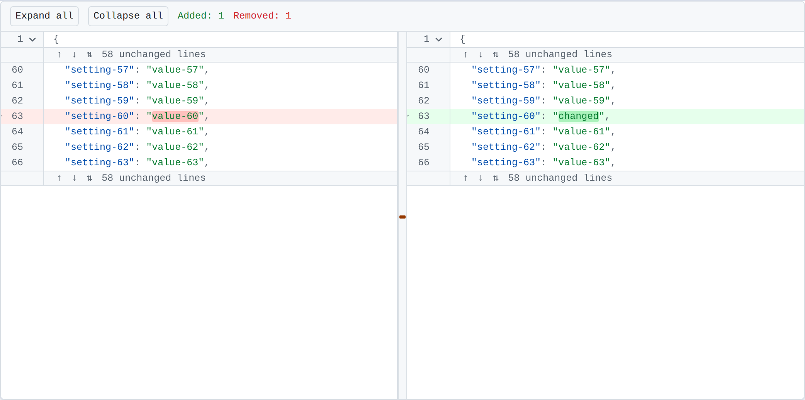

<div align="center">

<picture>
  <source media="(prefers-color-scheme: dark)" srcset="./docs/assets/logo-dark.svg">
  
</picture>

# Krona

**Сворачиваемый просмотр и построчное сравнение конфигурационных файлов — React-компонент.**

JSON/JSONC · YAML · TOML · INI/.env

[**Открыть демо →**](https://critow.github.io/krona/)

[English](./README.md) · [Русский](./README.ru.md)

[](https://github.com/critow/krona/actions/workflows/ci.yml)
[](./LICENSE)
[](#проектные-решения)
[](#справочник-пропсов)
[](#установка)

</div>

---

- **Сворачивает как редактор.** Объекты, массивы, YAML-блоки, TOML-таблицы и INI-секции сворачиваются из гаттера, а на месте скрытого остаётся плейсхолдер: `{ 3 items }`.
- **Сравнивает как git.** Построчно, две панели, подсветка изменённых фрагментов внутри строки и длинные неизменённые участки, свёрнутые в разворачиваемую полосу.
- **Разбирается на части.** У каждого режима есть раскладка по умолчанию, но он собирается из тех же публичных частей, если нужна своя.
- **Редактируется как текст.** Вьюер правит значения, строки и блоки целиком, с отменой и повтором. Каждое изменение заменяет участок исходника и переразбирает его, поэтому выдумать несуществующий в формате синтаксис оно не может.
- **Быстрый на реальных файлах.** Лок-файл на 60 тысяч строк разбирается за ~30 мс и диффится за ~62 мс; отрисовка виртуализирована, токенизация ленивая.
- **Три рантайм-зависимости.** `jsonc-parser`, `yaml`, `diff`. И всё.
- **Безопасен к недоверенному содержимому.** Нигде нет `innerHTML`, из файла не строится ни одного JavaScript-объекта, bidi- и невидимые символы рисуются видимыми плашками.


## Содержание

- [Установка](#установка)
- [Быстрый старт](#быстрый-старт)
- [Форматы](#форматы)
- [Справочник пропсов](#справочник-пропсов)
  - [`<Krona>`](#krona)
  - [`<Krona.Viewer>`](#kronaviewer)
  - [`<Krona.Diff>`](#kronadiff)
  - [Части](#части)
- [Редактирование](#редактирование)
- [Своя раскладка](#своя-раскладка)
- [Хуки](#хуки)
- [Локализация](#локализация)
- [Маленькие экраны](#маленькие-экраны)
- [Темы](#темы)
- [Лимиты безопасности](#лимиты-безопасности)
- [Большие файлы и Web Workers](#большие-файлы-и-web-workers)
- [Ядро без React](#ядро-без-react)
- [Проектные решения](#проектные-решения)
- [Планы](#планы)
- [Разработка](#разработка)
- [Лицензия](#лицензия)

## Установка

```bash
npm install krona
```

React 18 или 19 — peer-зависимость.

## Быстрый старт

```tsx
import { Krona } from 'krona'

// Просмотр
<Krona format="yaml" theme="dark">
  <Krona.Viewer source={text} defaultCollapsedDepth={2} />
</Krona>

// Сравнение
<Krona format="json" theme="dark">
  <Krona.Diff left={before} right={after} collapseUnchanged />
</Krona>
```

Стили подключаются сами. Для SSR или собственного CSS-пайплайна передайте
`injectStyles={false}` и подключите `import 'krona/styles.css'` вручную.


## Форматы

Импорт `krona` регистрирует **JSON/JSONC**, **TOML** и **INI/.env**. YAML вынесен
в отдельную точку входа: парсер `yaml` весит десятки килобайт и не должен
попадать в бандл тем, кому нужен только JSON:

```tsx
import 'krona/yaml'
```

`format="auto"` определяет формат по содержимому, но только среди реально
импортированных провайдеров — он никогда не «оживит» тот, который вы решили не
включать. Неизвестный формат, битый файл или слишком большой вход деградируют в
plain text с диагностикой, а не в исключение.

| Формат | Точка входа | Что сворачивается |
| --- | --- | --- |
| JSON / JSONC | `krona` | Объекты и массивы; комментарии и висящие запятые допустимы |
| YAML | `krona/yaml` | Отступы, блочные скаляры (`\|`, `>`), многострочные flow-коллекции |
| TOML | `krona` | `[table]` и `[[array of tables]]`, вложенность по составному имени; многострочные строки и массивы |
| INI | `krona` | `[section]`, вложенность по составному имени |
| .env | `krona` | Ничего — в плоском файле нечего сворачивать, только подсветка |

## Справочник пропсов

### `<Krona>`

Корень конфигурации. Держит формат, тему и подписи в контексте и не рисует
ничего, кроме темизированного контейнера; разбор и состояние живут в режимах
внутри.

| Проп | Тип | По умолчанию | Описание |
| --- | --- | --- | --- |
| `format` | `Format` | `'auto'` | Идентификатор провайдера или `'auto'` — определить среди [зарегистрированных](#форматы) |
| `theme` | `'light' \| 'dark' \| 'auto'` | `'auto'` | `'auto'` следует за `prefers-color-scheme` |
| `labels` | `Partial<KronaLabels>` | английские дефолты | Все видимые строки — см. [Локализация](#локализация) |
| `locale` | `string` | системная | Локаль BCP 47 для `Intl.NumberFormat` в дефолтных подписях |
| `lineHeight` | `number` | `20` | Высота строки в пикселях; заодно задаёт `--krona-line-height`. Именно фиксированная высота делает виртуализацию точной |
| `narrowWidth` | `number` | `640` | Уже этой ширины режимы верстаются под маленький экран — см. [Маленькие экраны](#маленькие-экраны). Измеряется по корню, а не по окну; `0` отключает |
| `limits` | `Partial<ParseLimits>` | см. [Лимиты](#лимиты-безопасности) | Переопределение границ парсера |
| `providers` | `FormatRegistry` | модульный реестр | Свой реестр провайдеров |
| `injectStyles` | `boolean` | `true` | Добавляет стили в `document.head` при монтировании |
| `className` / `style` | — | — | На темизированный контейнер |

### `<Krona.Viewer>`

| Проп | Тип | По умолчанию | Описание |
| --- | --- | --- | --- |
| `source` | `string` | — | Содержимое файла. Передайте это **или** `model` |
| `model` | `DocumentModel` | — | Модель, разобранная снаружи, например [в воркере](#большие-файлы-и-web-workers). Приоритетнее `source` |
| `format` | `Format` | из `<Krona>` | Переопределяет формат |
| `labels` | `Partial<KronaLabels>` | из `<Krona>` | Переопределяет подписи |
| `defaultCollapsedDepth` | `number` | — | Свернуть все диапазоны этой глубины и глубже — при монтировании и при каждой смене значения; `0` сворачивает всё |
| `overscan` | `number` | `8` | Сколько строк рисовать за пределами вьюпорта |
| `showDiagnostics` | `boolean` | `true` | Показывать ошибки разбора над документом (в раскладке по умолчанию) |
| `editable` | `boolean` | `false` | Разрешить правку документа — см. [Редактирование](#редактирование) |
| `onChange` | `(source: string) => void` | — | Вызывается со всем документом после каждой правки, отмены и повтора |
| `className` / `style` | — | — | На область просмотра |
| `children` | `ReactNode` | раскладка по умолчанию | [Своя раскладка](#своя-раскладка) из тех же публичных частей |

### `<Krona.Diff>`

| Проп | Тип | По умолчанию | Описание |
| --- | --- | --- | --- |
| `left` / `right` | `string` | — | Две версии. Передайте их **или** пропсы с моделями |
| `leftModel` / `rightModel` | `DocumentModel` | — | Заранее разобранные модели, например [из воркера](#большие-файлы-и-web-workers) |
| `format` | `Format` | из `<Krona>` | Переопределяет формат |
| `labels` | `Partial<KronaLabels>` | из `<Krona>` | Переопределяет подписи |
| `collapseUnchanged` | `boolean \| CollapseUnchangedOptions` | `false` | Прятать длинные неизменённые участки в разворачиваемую полосу |
| `defaultCollapsedDepth` | `number` | — | Свернуть при загрузке диапазоны этой глубины и глубже |
| `ignoreTrailingWhitespace` | `boolean` | `false` | Сравнивать строки без учёта хвостовых пробелов |
| `showMinimap` | `boolean` | `false` | Показывать миникарту изменений между панелями |
| `overscan` | `number` | `8` | Сколько строк рисовать за пределами вьюпорта |
| `className` / `style` | — | — | На область сравнения |
| `children` | `ReactNode` | две панели | [Своя раскладка](#своя-раскладка) |

`CollapseUnchangedOptions`:

| Опция | Тип | По умолчанию | Описание |
| --- | --- | --- | --- |
| `context` | `number` | `3` | Сколько неизменённых строк оставить с каждой стороны изменения |
| `minimumHidden` | `number` | `10` | Самый короткий участок, который стоит прятать; ниже полоса займёт больше места, чем сэкономит |
| `step` | `number` | `20` | Сколько строк открывает одно нажатие кнопок вверх / вниз |

Строку, открывающую диапазон сворачивания, эта свёртка не прячет никогда —
участок разрезается вокруг неё, чтобы шеврон остался доступен.

### Части

Каждая часть принимает `className` и `style`. `Gutter`, `Lines` и `Toolbar` —
*одни и те же компоненты* в обоих режимах: они читают ближайший источник строк и
не знают, в каком режиме находятся.

| Часть | Где место | Примечания |
| --- | --- | --- |
| `Krona.Gutter` | просмотр или панель | Номера строк, маркеры diff, шевроны. `showMarkers?: boolean` |
| `Krona.Lines` | просмотр или панель | Текст документа, подсветка и плейсхолдеры свёрнутого. `showCopyActions?: boolean` |
| `Krona.Toolbar` | над содержимым | Действия сворачивания, а в diff — счётчики изменений. Принимает `children` |
| `Krona.Diagnostics` | над содержимым | Проблемы разбора. `includeWarnings?: boolean` |
| `Krona.Panel` | только diff | Одна сторона. `side: 'left' \| 'right'` |
| `Krona.Minimap` | только diff | Карта изменений между панелями; вне diff бросает ошибку |
| `Krona.SideSwitch` | только diff | Выбирает версию, которую показывает [узкий](#маленькие-экраны) дифф. `always?: boolean`; где помещаются обе панели — не рисует ничего |
| `Krona.ExpandBar` | рисуется сама | Полоса скрытых строк; экспортирована для перестилизации |

## Редактирование

`<Krona.Viewer editable>` превращает документ в редактируемый. Двойной клик по
значению правит его на месте; действия строки, появляющиеся при наведении,
открывают строку как текст, открывают блок целиком как текст, удаляют запись или
дублируют её.
`Enter` применяет, `Escape` отменяет, в редакторе блока применяет
`Ctrl`/`Cmd` + `Enter`. Отмена и повтор — в тулбаре.

Новые записи создаются **дублированием**. Копия — единственная новая запись,
заведомо корректная там, где она появляется: это уже запись этого контейнера, в
этом формате, с этим отступом, поэтому Krona не должна знать, как выглядит новый
ключ в TOML в отличие от YAML. Копия сразу открывается на правку.

```tsx
const [text, setText] = useState(initial)

<Krona format="json">
  <Krona.Viewer source={text} editable onChange={setText} />
</Krona>
```

Правка объекта или массива приводит их к тому виду, в котором написан остальной
файл. Наберите или вставьте в редактор блока `{"host":"10.0.0.1","port":9090}` —
и получится блок с отступами как у соседей, причём ширина отступа берётся из
документа, а не из настройки: отформатировать один блок в стиле, которого в
файле нет, хуже, чем не форматировать вовсе. Затрагивается только изменённый
участок, всё вокруг сохраняет тот вид, какой имело. Значение, изменённое на
месте, остаётся на своей строке — переливка строки сдвинула бы текст, на который
вы не смотрели.

Форматирование — это текст на входе и текст на выходе, и это дело провайдера: у
JSON и JSONC оно есть, а формат, чей провайдер его не предлагает, оставляет
набранный текст как есть. Форматтер, ходящий через разобранное значение, построил
бы тот самый JavaScript-объект, который вся остальная Krona аккуратно не строит,
и потерял бы всё, чему в модели значений формата нет места — в случае JSON
комментарии. Правка и вызванное ею форматирование — один шаг отмены.

Любая правка — это правка **текста**: заменяется участок исходника, и результат
разбирается заново. Ничего не записывается обратно через JavaScript-объект,
поэтому правка не может выдумать синтаксис, которого в формате нет — она лишь
переставляет символы, которые вы набрали. По той же причине редактирование
одинаково работает во всех форматах: значение в YAML и значение в TOML — это
одинаково участок текста.

Удаление записи забирает с собой перевод строки и запятую, которая иначе
осталась бы висеть перед закрывающей скобкой: правка, надёжно порождающая
синтаксическую ошибку, — это не правка, а ловушка. Сломанный ввод в любом случае
остаётся на экране: документ, переставший разбираться, деградирует в plain text
с диагностикой, так что недописанная правка не гасит вид.

История отмены хранит обратные правки, а не снимки, поэтому сто шагов на файле в
мегабайт стоят сотни коротких строк.

С `editable` вьюер владеет текстом и пересевается при каждой смене `source`.
`useKronaViewer()` отдаёт текущий документ и историю:

```tsx
const { source, canUndo, canRedo, undo, redo } = useKronaViewer()
```

`<Krona.Diff>` остаётся только для чтения. Сравнить две версии — задача другая,
чем изменить одну из них, и у диффа нет единственного документа, в который можно
писать.

**Копирование не требует правки.** Оба режима дают действия копирования на
строке под курсором — отдельно значение и запись целиком, то есть весь блок,
если строка его открывает. Отключается через
`<Krona.Lines showCopyActions={false} />`.

Третье действие копирует **путь** до того, что вводит строка —
`server.tls.ciphers[0]`, — и тултип показывает его до того, как вы его возьмёте.
Пути даёт провайдер: он записывает единственный отрезок, который добавляет
каждая строка, попутно, за тот же проход по файлу; сам путь собирается из
объемлющих fold-диапазонов, поэтому документ хранит по одной короткой строке на
строку, а не копию всех предков у каждого потомка. Отдают их все четыре формата:
точечные ключи и заголовки `[table]` в TOML, секции в INI, отступы и индексы
последовательностей в YAML.

Путь именует строку. Строка с несколькими записями отвечает первой, а строка,
которая не вводит ничего своего — закрывающая скобка, — отвечает блоком, в
котором находится.


## Своя раскладка

`Krona.Viewer` и `Krona.Diff` без children рисуют раскладку по умолчанию. Если
передать children, вы собираете её сами из тех же публичных частей; между ними
можно класть любой свой JSX.

```tsx
<Krona format="json">
  <Krona.Diff left={before} right={after} collapseUnchanged showMinimap>
    <Krona.Toolbar>
      <button onClick={download}>Скачать</button>
    </Krona.Toolbar>
    <Krona.Panel side="left">
      <Krona.Gutter />
      <Krona.Lines />
    </Krona.Panel>
    <Krona.Minimap />
    <Krona.Panel side="right">
      <Krona.Gutter />
      <Krona.Lines />
    </Krona.Panel>
  </Krona.Diff>
</Krona>
```

Части сами объявляют, куда относятся, — поэтому их можно писать как обычных
соседей, и они всё равно окажутся внутри нужного контейнера прокрутки. Ваш
собственный компонент по умолчанию встанет над содержимым.

## Хуки

```tsx
const { model, collapsed, toggleFold, expandAll, collapseAll, visibleLines } = useKronaViewer()
const { source, editable, canUndo, canRedo, undo, redo } = useKronaViewer() // правка
const { alignedRows, visibleRows, stats, expandContext, toggleRowFold } = useKronaDiff()
const { format, theme, labels, lineHeight } = useKronaConfig()
```

Каждый бросает понятную ошибку вне своего режима, поэтому тулбар не на своём
месте падает на первом же рендере, а не рисует пустоту.

```tsx
function ChangeCount() {
  const { stats } = useKronaDiff()
  return <span>добавлено {stats.added}, удалено {stats.removed}</span>
}
```

## Локализация

Внутри Krona **нет i18n-рантайма**. Каждая видимая строка — английский дефолт,
который заменяется через `labels`, так что правила множественного числа и
загрузка переводов остаются в приложении, где им и место. Числа в дефолтных
подписях форматируются через `Intl.NumberFormat` с учётом `locale`.

| Подпись | Сигнатура | Дефолт | Где появляется |
| --- | --- | --- | --- |
| `expandAll` / `collapseAll` | `string` | `Expand all` / `Collapse all` | Тулбар |
| `expandBlock` / `collapseBlock` | `string` | `Expand block` / `Collapse block` | Шеврон в гаттере, доступное имя |
| `foldedItems` | `(count: number) => string` | `6 items` | Плейсхолдер свёрнутого, когда известно число элементов |
| `foldedLines` | `(count: number) => string` | `12 lines` | Плейсхолдер для блочных скаляров |
| `hiddenLines` | `(count: number) => string` | `12 unchanged lines` | Полоса разворачивания в diff |
| `expandUp` / `expandDown` / `expandAllHidden` | `string` | `Expand up` / … | Кнопки на полосе |
| `added` / `removed` / `changed` / `unchanged` | `string` | `Added` / … | Счётчики в тулбаре |
| `leftPanel` / `rightPanel` | `string` | `Previous version` / `Current version` | Доступные имена панелей |
| `changeMap` | `string` | `Change map` | Доступное имя миникарты |
| `unsafeCharacter` | `(code: string) => string` | `Hidden character U+202E` | Подсказка на плашке опасного символа |
| `document` | `string` | `Configuration file` | Доступное имя области |
| `editValue` | `string` | `Edit value` | Подсказка на редактируемом значении |
| `editLine` | `string` | `Edit line` | Действие строки: открыть её как текст |
| `editBlock` | `string` | `Edit block` | Действие строки: открыть блок как текст |
| `deleteEntry` | `string` | `Delete` | Действие строки: удалить запись |
| `saveEdit` | `string` | `Save` | Применяет открытый редактор |
| `cancelEdit` | `string` | `Cancel` | Отменяет открытый редактор |
| `undo` | `string` | `Undo` | Действие тулбара: отменить последнюю правку |
| `redo` | `string` | `Redo` | Действие тулбара: повторить отменённое |
| `duplicateEntry` | `string` | `Duplicate` | Действие строки: повторить запись ниже |
| `copyEntry` | `string` | `Copy` | Действие строки: скопировать запись или блок |
| `copyValue` | `string` | `Copy value` | Действие строки: скопировать только значение |
| `copyPath` | `string` | `Copy path` | Действие строки: скопировать путь до строки |
| `copied` | `string` | `Copied` | Ненадолго показывается после копирования |

Русскому нужны три формы множественного числа — ровно поэтому склонения живут в
приложении, а не в библиотеке:

```tsx
function plural(n: number, one: string, few: string, many: string): string {
  const mod10 = n % 10
  const mod100 = n % 100
  if (mod10 === 1 && mod100 !== 11) return one
  if (mod10 >= 2 && mod10 <= 4 && (mod100 < 12 || mod100 > 14)) return few
  return many
}

<Krona
  locale="ru"
  labels={{
    collapseAll: 'Свернуть всё',
    expandAll: 'Развернуть всё',
    foldedItems: (n) => `${n} ${plural(n, 'элемент', 'элемента', 'элементов')}`,
  }}
>
  <Krona.Viewer source={text} />
</Krona>
```

## Маленькие экраны

Уже `narrowWidth` (по умолчанию 640px) дифф показывает **одну панель за раз**, с
переключателем стороны в тулбаре. Поделить ширину телефона между двумя панелями
значит дать примерно по десять символов на каждую — то есть не показать ни одной
версии; читатель вместо этого переключает сторону, поверх тех же выровненных
строк, так что номера строк по-прежнему соответствуют тому, что было на другой
стороне. Гаттер тоже сужается.

Измеряется ширина **корня**, а не окна. Диффу в боковой панели на широком экране
тесно ровно так же, как на телефоне, а медиазапрос этой разницы не видит.
`narrowWidth={0}` оставляет широкую раскладку на любом размере.

```tsx
<Krona format="json" narrowWidth={480}>
  <Krona.Diff left={before} right={after} />
</Krona>
```

`useKronaDiff()` отдаёт то же состояние, если переключатель нужен свой:

```tsx
const { narrow, side, showSide } = useKronaDiff()
```

Действия строки там, где наводить нечем, показываются без наведения — чтобы до
них можно было дотянуться тапом.

## Темы

Всё управляется CSS-переменными `--krona-*`. Переопределите их на любом предке —
трогать селекторы не нужно.

```css
.my-viewer {
  --krona-height: 40rem;
  --krona-line-height: 22px;
  --krona-font-family: 'JetBrains Mono', monospace;
  --krona-token-key: #b45309;
}
```

| Группа | Переменные |
| --- | --- |
| Раскладка | `--krona-height`, `--krona-line-height`, `--krona-font-family`, `--krona-font-size`, `--krona-gutter-width`, `--krona-padding-inline` |
| Поверхности | `--krona-bg`, `--krona-bg-gutter`, `--krona-bg-hover`, `--krona-border`, `--krona-fg`, `--krona-fg-muted` |
| Контролы | `--krona-chevron`, `--krona-chevron-hover` |
| Токены | `--krona-token-key`, `-string`, `-number`, `-boolean`, `-null`, `-comment`, `-punctuation`, `-section` |
| Diff | `--krona-added-bg`, `--krona-added-strong-bg`, `--krona-removed-bg`, `--krona-removed-strong-bg`, `--krona-spacer-bg`, `--krona-added-marker`, `--krona-removed-marker` |
| Предупреждения | `--krona-unsafe-bg`, `--krona-unsafe-fg` |
| Тултипы | `--krona-tooltip-bg`, `--krona-tooltip-fg` |

`theme="light" \| "dark" \| "auto"`; `auto` следует за `prefers-color-scheme`.



## Лимиты безопасности

Содержимое файла — всегда недоверенные данные. У каждой границы ниже есть
дефолт, она настраивается через `limits` и деградирует с внятной диагностикой, а
не зависшей вкладкой.

| Лимит | Дефолт | Что происходит за ним |
| --- | --- | --- |
| `maxInputLength` | 10 МиБ | Plain text, без сворачивания и подсветки, диагностика-ошибка |
| `maxDepth` | 64 | Более глубокие диапазоны отбрасываются, диагностика-предупреждение |
| `maxFoldRanges` | 200 000 | Сворачивание прекращается, диагностика-предупреждение |
| `maxTokenizedLineLength` | 10 000 | Такая строка рисуется без подсветки |
| `maxValidatedLength` | 64 КиБ | YAML пропускает проход валидации; на сворачивание и подсветку это не влияет |

У diff свой бюджет: Майерс — O(ND), поэтому `timeout` (по умолчанию 1500 мс)
переключает на приближение по общему префиксу и суффиксу — ровно тот же размен,
который делает git, когда его эвристики сдаются.

## Большие файлы и Web Workers

Разбор и diff — линейные проходы, и оба укладываются в бюджет кадра на файле,
относительно которого написан бенчмарк: две версии `package-lock.json` на ~60
тысяч строк.

| | |
| --- | --- |
| разбор 60k строк | ~30 мс |
| diff двух версий по 60k строк | ~62 мс |
| выравнивание diff | ~70 мс |
| токенизация одного экрана | ~29 мс |

Проверить: `pnpm bench`.

Примерно от мегабайта работу стоит унести с основного потока. Модель — обычные
данные, поэтому её можно вернуть из воркера:

```ts
// worker.ts
import { parseDocument, toSnapshot } from '@krona/core'
import '@krona/core/yaml'

self.onmessage = ({ data }) => {
  const model = parseDocument(data.source, data.format)
  self.postMessage(toSnapshot(model))
}
```

```tsx
// app.tsx
import { fromSnapshot } from '@krona/core'

const [model, setModel] = useState<DocumentModel>()
useEffect(() => {
  const worker = new Worker(new URL('./worker.ts', import.meta.url), { type: 'module' })
  worker.onmessage = ({ data }) => setModel(fromSnapshot(data))
  worker.postMessage({ source, format: 'yaml' })
  return () => worker.terminate()
}, [source])

return model ? (
  <Krona>
    <Krona.Viewer model={model} />
  </Krona>
) : null
```

Сам воркер Krona не создаёт — URL воркера зависит от сборщика, — но пропсы
`model`, `leftModel` и `rightModel` делают этот путь полноценным.

## Ядро без React

```ts
import { parseDocument, diffLines, alignDiff, intralineDiff } from '@krona/core'
import '@krona/core/yaml'

const doc = parseDocument(source, 'yaml')
doc.lines            // строки исходника
doc.foldingRanges    // сворачиваемые диапазоны
doc.tokensAt(12)     // токены одной строки, лениво и с кэшем
doc.diagnostics      // проблемы разбора, наружу не бросаются
```

| Функция | Возвращает |
| --- | --- |
| `parseDocument(source, format?, options?)` | `DocumentModel` — из-за содержимого не бросает никогда |
| `diffLines(left, right, options?)` | `DiffResult` — участки строк и флаг `approximate`, если бюджет исчерпан |
| `alignDiff(result, options?)` | `AlignedDiff` — строки для двух панелей со спейсерами и `stats` |
| `intralineDiff(left, right, options?)` | Пословные диапазоны для одной изменённой строки |
| `collapseUnchanged(rows, options?)` | Участки, которые стоит спрятать за полосу |
| `scanUnsafeCharacters(text)` | Bidi- и невидимые символы с позициями |
| `toSnapshot` / `fromSnapshot` | Проекция, безопасная для structured clone, — для воркеров |

## Проектные решения

**Название — это крона дерева, а не корона монарха.** Krona показывает документ
деревом, которое сворачивается ветка за веткой; крона — это форма целого до
того, как вы разглядываете отдельную ветку, и свёрнутый конфигурационный файл
даёт ровно это. Знак говорит обе половины сразу: файл, свёрнутый в дерево строк,
рядом два знака диффа — и всё это прорастает деревом. Лежит в `docs/assets`:
`logo-light.svg` и `logo-dark.svg` — знак, `logotype-*` — знак со словом,
`logo.svg` выбирает палитру по теме читателя.

**Модель — строки, а не дерево значений.** Diff построчный, сворачивание —
диапазонами, поэтому `строки + диапазоны сворачивания` обслуживают и то, и
другое. Krona никогда не строит JavaScript-объект из вашего файла — поэтому
prototype pollution через ключ `__proto__` здесь просто неприменим.

**Перестановка ключей — настоящее изменение.** Krona сравнивает текст, ровно как
git. Семантический diff скрыл бы изменения, которые в конфиге важны.

**Опасные символы показываются, а не отрисовываются.** Bidi-контролы
([Trojan Source](https://trojansource.codes/), CVE-2021-42574) и невидимые
символы рисуются видимыми плашками `U+XXXX`. Diff, отрисовывающий их как есть,
может показать два разных файла одинаковыми.

**Панели скроллятся как одна, по обеим осям.** Строки фиксированной высоты, а
список строк у панелей общий, поэтому вертикальная синхронизация — точное
копирование `scrollTop`, а не пересчёт по доле. По горизонтали обе панели
резервируют ширину самой длинной строки *любого* из двух документов, так что
колонка n находится на одном и том же смещении с обеих сторон — читать одну и ту
же колонку слева и справа и есть смысл построчного сравнения.

**Никакого `innerHTML`.** Содержимое выводится текстовыми нодами React; правило
закреплено линтером.

**Алиасы никогда не разворачиваются.** YAML-бомба стоит не больше своего размера.

## Планы

Krona 0.1 показывает один конфигурационный файл или два рядом и даёт
[править](#редактирование) первый. Всё, что ниже, отсутствует намеренно, а не по
забывчивости.

| Нет в 0.1 | Почему | Вероятность |
| --- | --- | --- |
| Построчный (unified) дифф | Две панели отвечают на вопрос, ради которого библиотека и существует. Unified — это вторая раскладка поверх тех же выровненных строк, её дёшево добавить, когда модель строк устоится. | Дальше |
| Поиск по документу | Нужен индекс совпадений, переживающий свёртку и виртуализацию; лучше сделать нормально, чем рано. | Дальше |
| Unified-дифф на телефоне | Узкий дифф сегодня показывает одну сторону за раз — читается хорошо, но чтобы сравнить, надо переключаться. Unified тут отвечает лучше, и это та же вторая раскладка, что строкой выше. | Дальше |
| Другие форматы (XML, `.properties`, HCL) | Каждый — это провайдер, `analyze` и `tokenize` за тем же интерфейсом. Ждём, когда кому-то реально понадобится. | Может быть |
| Семантический дифф | Перестановка ключей — это *настоящее* различие в конфиге. Krona сравнивает текст, ровно как git. | Не планируется |

Issues и pull request'ы приветствуются. Команды — в разделе
[Разработка](#разработка), список изменений — в [CHANGELOG.md](./CHANGELOG.md).

## Разработка

```bash
pnpm install
pnpm dev            # песочница на http://localhost:5173
pnpm test           # юнит-тесты (node)
pnpm test:browser   # компонентные тесты в настоящем Chromium — не в jsdom
pnpm test:visual    # попиксельное сравнение скриншотов Playwright
pnpm bench
pnpm verify         # линт, типы, все тесты, сборка
```

Компонентные тесты идут в настоящем браузере намеренно: виртуализация и
синхронный скролл зависят от layout и прокрутки, которых в jsdom нет. Эталонные
скриншоты обновляются только отдельным осознанным коммитом
(`pnpm test:visual:update`).

## Лицензия

MIT
