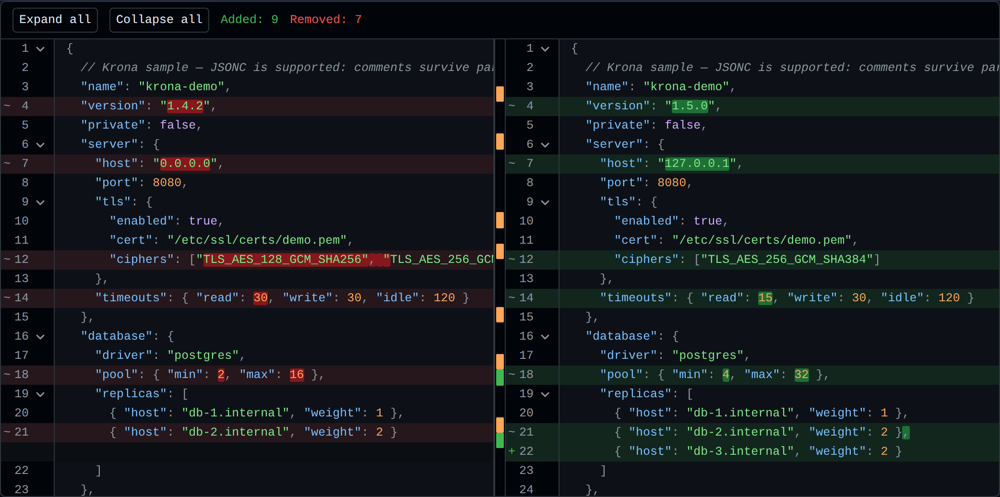
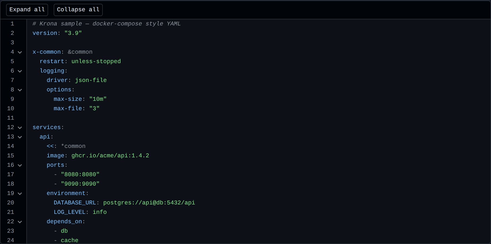

<div align="center">

<picture>
  <source media="(prefers-color-scheme: dark)" srcset="./docs/assets/logo-dark.svg">
  
</picture>

# Krona

**Свернуть, сравнить и отредактировать конфигурационный файл — React-компонент, который
никогда не превращает ваш файл в объект.**

JSON/JSONC · YAML · TOML · INI/.env

[**Открыть демо →**](https://critow.github.io/krona/)

[English](./README.md) · [Русский](./README.ru.md)

[](https://github.com/critow/krona/actions/workflows/ci.yml)
[](./LICENSE)
[](#проектные-решения)
[](./docs/reference.ru.md#справочник-пропсов)
[](#установка)

</div>

---

- **Сворачивает как редактор.** Объекты, массивы, YAML-блоки, TOML-таблицы и INI-секции сворачиваются из гаттера, а на месте скрытого остаётся плейсхолдер: `{ 3 items }`.
- **Сравнивает как git.** Построчно, две панели, подсветка изменённых фрагментов внутри строки и длинные неизменённые участки, свёрнутые в разворачиваемую полосу.
- **Разбирается на части.** У каждого режима есть раскладка по умолчанию, но он собирается из тех же публичных частей, если нужна своя.
- **Редактируется как текст.** Вьюер правит значения, строки и блоки целиком, с отменой и повтором. Каждое изменение заменяет участок исходника и переразбирает его, поэтому выдумать несуществующий в формате синтаксис оно не может.
- **Быстрый на реальных файлах.** Лок-файл на 60 тысяч строк разбирается за ~30 мс и диффится за ~62 мс; отрисовка виртуализирована, токенизация ленивая.
- **Пять пакетов в дереве установки.** `jsonc-parser`, `yaml` и `diff` разбирают и сравнивают;
  `@tanstack/react-virtual` и его `@tanstack/virtual-core` виртуализируют. Проверка в CI
  роняет сборку, если появится шестой. `@kronajs/core` — наш, React — peer.
- **Безопасен к недоверенному содержимому.** Нигде нет `innerHTML`, из файла не строится ни одного JavaScript-объекта, bidi- и невидимые символы рисуются видимыми плашками.



## Содержание

- [Установка](#установка)
- [Быстрый старт](#быстрый-старт)
- [Форматы](#форматы)
- [Справочник](#справочник) — пропсы, части, лейблы, темы, лимиты
- [Редактирование](#редактирование)
- [Своя раскладка](#своя-раскладка)
- [Хуки](#хуки)
- [Поиск](#поиск)
- [Клавиатура](#клавиатура)
- [Маленькие экраны](#маленькие-экраны)
- [Большие файлы и Web Workers](#большие-файлы-и-web-workers)
- [Ядро без React](#ядро-без-react)
- [Проектные решения](#проектные-решения)
- [Планы](#планы)
- [Разработка](#разработка)
- [Лицензия](#лицензия)

## Установка

```bash
npm install kronajs
```

React 18 или 19 — peer-зависимость.

## Быстрый старт

```tsx
import { Krona } from 'kronajs'

// Просмотр
<Krona format="yaml" theme="dark">
  <Krona.Viewer source={text} defaultCollapsedDepth={2} />
</Krona>

// Сравнение
<Krona format="json" theme="dark">
  <Krona.Diff left={before} right={after} collapseUnchanged />
</Krona>
```

Стили подключаются сами. Для SSR или собственного CSS-пайплайна передайте
`injectStyles={false}` и подключите `import 'kronajs/styles.css'` вручную.



## Форматы

Импорт `kronajs` регистрирует **JSON/JSONC**, **TOML** и **INI/.env**. YAML вынесен
в отдельную точку входа: парсер `yaml` весит десятки килобайт и не должен
попадать в бандл тем, кому нужен только JSON:

```tsx
import 'kronajs/yaml'
```

`format="auto"` определяет формат по содержимому, но только среди реально
импортированных провайдеров — он никогда не «оживит» тот, который вы решили не
включать. Неизвестный формат, битый файл или слишком большой вход деградируют в
plain text с диагностикой, а не в исключение.

| Формат | Точка входа | Что сворачивается |
| --- | --- | --- |
| JSON / JSONC | `kronajs` | Объекты и массивы; комментарии и висящие запятые допустимы |
| YAML | `kronajs/yaml` | Отступы, блочные скаляры (`\|`, `>`), многострочные flow-коллекции |
| TOML | `kronajs` | `[table]` и `[[array of tables]]`, вложенность по составному имени; многострочные строки и массивы |
| INI | `kronajs` | `[section]`, вложенность по составному имени |
| .env | `kronajs` | Ничего — в плоском файле нечего сворачивать, только подсветка |

## Справочник

Все пропсы, части, лейблы, CSS-переменные и лимиты разбора — в
**[docs/reference.ru.md](./docs/reference.ru.md)**: пропсы `<Krona>`,
`<Krona.Viewer>` и `<Krona.Diff>`, части для своей раскладки, лейблы для
перевода, переменные `--krona-*` и лимиты разбора.

## Редактирование

`<Krona.Viewer editable>` превращает документ в редактируемый. Двойной клик по
значению правит его на месте; действия строки, появляющиеся при наведении,
открывают строку как текст, открывают блок целиком как текст, удаляют запись или
дублируют её.
`Enter` применяет, `Escape` отменяет, в редакторе блока применяет
`Ctrl`/`Cmd` + `Enter`. Отмена и повтор — в тулбаре.

Новые записи создаются **дублированием**. Копия — единственная новая запись,
заведомо корректная там, где она появляется: это уже запись этого контейнера, в
этом формате, с этим отступом, поэтому Krona не должна знать, как выглядит новый
ключ в TOML в отличие от YAML. Копия сразу открывается на правку.

```tsx
const [text, setText] = useState(initial)

<Krona format="json">
  <Krona.Viewer source={text} editable onChange={setText} />
</Krona>
```

Правка объекта или массива приводит их к тому виду, в котором написан остальной
файл. Наберите или вставьте в редактор блока `{"host":"10.0.0.1","port":9090}` —
и получится блок с отступами как у соседей, причём ширина отступа берётся из
документа, а не из настройки: отформатировать один блок в стиле, которого в
файле нет, хуже, чем не форматировать вовсе. Затрагивается только изменённый
участок, всё вокруг сохраняет тот вид, какой имело. Значение, изменённое на
месте, остаётся на своей строке — переливка строки сдвинула бы текст, на который
вы не смотрели.

Форматирование — это текст на входе и текст на выходе, и это дело провайдера: у
JSON и JSONC оно есть, а формат, чей провайдер его не предлагает, оставляет
набранный текст как есть. Форматтер, ходящий через разобранное значение, построил
бы тот самый JavaScript-объект, который вся остальная Krona аккуратно не строит,
и потерял бы всё, чему в модели значений формата нет места — в случае JSON
комментарии. Правка и вызванное ею форматирование — один шаг отмены.

Любая правка — это правка **текста**: заменяется участок исходника, и результат
разбирается заново. Ничего не записывается обратно через JavaScript-объект,
поэтому правка не может выдумать синтаксис, которого в формате нет — она лишь
переставляет символы, которые вы набрали. По той же причине редактирование
одинаково работает во всех форматах: значение в YAML и значение в TOML — это
одинаково участок текста.

Удаление записи забирает с собой перевод строки и запятую, которая иначе
осталась бы висеть перед закрывающей скобкой: правка, надёжно порождающая
синтаксическую ошибку, — это не правка, а ловушка. Сломанный ввод в любом случае
остаётся на экране: документ, переставший разбираться, деградирует в plain text
с диагностикой, так что недописанная правка не гасит вид.

История отмены хранит обратные правки, а не снимки, поэтому сто шагов на файле в
мегабайт стоят сотни коротких строк.

С `editable` вьюер владеет текстом и пересевается при каждой смене `source`.
`useKronaViewer()` отдаёт текущий документ и историю:

```tsx
const { source, canUndo, canRedo, undo, redo } = useKronaViewer()
```

`<Krona.Diff>` остаётся только для чтения. Сравнить две версии — задача другая,
чем изменить одну из них, и у диффа нет единственного документа, в который можно
писать.

**Копирование не требует правки.** Оба режима дают действия копирования на
строке под курсором — отдельно значение и запись целиком, то есть весь блок,
если строка его открывает. Отключается через
`<Krona.Lines showCopyActions={false} />`.

Третье действие копирует **путь** до того, что вводит строка —
`server.tls.ciphers[0]`, — и тултип показывает его до того, как вы его возьмёте.
Пути даёт провайдер: он записывает единственный отрезок, который добавляет
каждая строка, попутно, за тот же проход по файлу; сам путь собирается из
объемлющих fold-диапазонов, поэтому документ хранит по одной короткой строке на
строку, а не копию всех предков у каждого потомка. Отдают их все четыре формата:
точечные ключи и заголовки `[table]` в TOML, секции в INI, отступы и индексы
последовательностей в YAML.

Путь именует строку. Строка с несколькими записями отвечает первой, а строка,
которая не вводит ничего своего — закрывающая скобка, — отвечает блоком, в
котором находится.


## Своя раскладка

`Krona.Viewer` и `Krona.Diff` без children рисуют раскладку по умолчанию. Если
передать children, вы собираете её сами из тех же публичных частей; между ними
можно класть любой свой JSX.

```tsx
<Krona format="json">
  <Krona.Diff left={before} right={after} collapseUnchanged showMinimap>
    <Krona.Toolbar>
      <button onClick={download}>Скачать</button>
    </Krona.Toolbar>
    <Krona.Panel side="left">
      <Krona.Gutter />
      <Krona.Lines />
    </Krona.Panel>
    <Krona.Minimap />
    <Krona.Panel side="right">
      <Krona.Gutter />
      <Krona.Lines />
    </Krona.Panel>
  </Krona.Diff>
</Krona>
```

Части сами объявляют, куда относятся, — поэтому их можно писать как обычных
соседей, и они всё равно окажутся внутри нужного контейнера прокрутки. Ваш
собственный компонент по умолчанию встанет над содержимым.

## Хуки

```tsx
const { model, collapsed, toggleFold, expandAll, collapseAll, visibleLines } = useKronaViewer()
const { source, editable, canUndo, canRedo, undo, redo } = useKronaViewer() // правка
const { alignedRows, visibleRows, stats, expandContext, toggleRowFold } = useKronaDiff()
const { format, theme, labels, lineHeight } = useKronaConfig()
```

Каждый бросает понятную ошибку вне своего режима, поэтому тулбар не на своём
месте падает на первом же рендере, а не рисует пустоту.

```tsx
function ChangeCount() {
  const { stats } = useKronaDiff()
  return <span>добавлено {stats.added}, удалено {stats.removed}</span>
}
```

## Поиск

`showSearch` ставит поле над документом, а `Krona.Search` — туда, куда его положит
ваша раскладка. Совпадения подсвечиваются по мере ввода; Enter и Shift+Enter
ходят по ним, как и кнопки шага.

```tsx
<Krona format="yaml">
  <Krona.Viewer source={text} showSearch />
</Krona>
```

**Ищется текст, а не шаблон.** Регулярное выражение, введённое в текстовое поле,
может ввести и незнакомец, а просмотрщик, переставший отвечать, хуже
просмотрщика, который находит меньше. Регистр по умолчанию не учитывается,
переключатель `Aa` это меняет.

Переход к совпадению **открывает всё, что его прячет** — свёрнутый блок,
скрытый участок неизменённых строк — и подкручивает к нему, так что совпадение в
файле, свёрнутом до заголовков, всё равно в одном нажатии.

В диффе ищутся обе версии, а совпадения упорядочены **по строкам экрана**, а не
по файлам: удалённая строка и заменившая её оказываются соседями.

Длинный поиск останавливается на 5000 совпадениях, и счётчик тогда показывает
`1 / 5000+`: число, по которому никто не пойдёт, не стоит памяти под него.

`useKronaSearch()` отдаёт то же состояние для своего контрола:

```tsx
const { query, setQuery, total, position, next, previous } = useKronaSearch()
```

`findMatches(model, query)` из ядра делает сам поиск, если UI не нужен.

## Клавиатура

Документ — дерево, и обходится как дерево. Tab входит в него один раз — таббельна
только та строка, на которой вы стоите, — дальше работают стрелки.

| Клавиша | Действие |
| --- | --- |
| `↑` `↓` | Предыдущая строка, следующая строка |
| `→` | Раскрыть свёрнутый блок, иначе — шаг вниз |
| `←` | Свернуть открытый блок, иначе — выйти к блоку, который содержит строку |
| `Enter` `Space` | Свернуть или раскрыть блок, который открывает строка |
| `Home` `End` | Первая строка, последняя строка |

У строк `role="treeitem"` с вложенностью, которую описывают диапазоны свёртки, —
экранный диктор сообщает, насколько глубоко лежит строка и раскрыт ли её блок.
Шевроны в жёлобе остаются кликабельными и сохраняют имена, но перестали быть
остановками Tab: строки виртуализованы, и до тех, что за экраном, Tab всё равно
не доходил.

## Маленькие экраны

Уже `narrowWidth` (по умолчанию 640px) дифф становится **unified**: одна колонка,
старая строка над новой. Поделить ширину телефона между двумя панелями значит
дать примерно по десять символов на каждую — то есть не показать ни одной версии,
а переключение сторон заставляет держать одну из них в голове. Unified отдаёт всю
ширину одной строке за раз и оставляет обе версии на экране. Гаттер тоже сужается.

`view="split"` оставляет две панели на любой ширине — узкий дифф тогда показывает
одну сторону, а меняет её `Krona.SideSwitch`. `view="unified"` держит одну колонку
на любой ширине.

Измеряется ширина **корня**, а не окна. Диффу в боковой панели на широком экране
тесно ровно так же, как на телефоне, а медиазапрос этой разницы не видит.
`narrowWidth={0}` оставляет широкую раскладку на любом размере.

```tsx
<Krona format="json" narrowWidth={480}>
  <Krona.Diff left={before} right={after} />
</Krona>
```

`useKronaDiff()` отдаёт то же состояние, если раскладка нужна своя:

```tsx
const { narrow, unified, side, showSide } = useKronaDiff()
```

Действия строки там, где наводить нечем, показываются без наведения — чтобы до
них можно было дотянуться тапом.

## Большие файлы и Web Workers

Разбор и diff — линейные проходы, и оба укладываются в бюджет кадра на файле,
относительно которого написан бенчмарк: две версии `package-lock.json` на ~60
тысяч строк.

| | |
| --- | --- |
| разбор 60k строк | ~30 мс |
| diff двух версий по 60k строк | ~62 мс |
| выравнивание diff | ~70 мс |
| токенизация одного экрана | ~29 мс |

Проверить: `pnpm bench`.

Примерно от мегабайта работу стоит унести с основного потока. Модель — обычные
данные, поэтому её можно вернуть из воркера:

```ts
// worker.ts
import { parseDocument, toSnapshot } from '@kronajs/core'
import '@kronajs/core/yaml'

self.onmessage = ({ data }) => {
  const model = parseDocument(data.source, data.format)
  self.postMessage(toSnapshot(model))
}
```

```tsx
// app.tsx
import { fromSnapshot } from '@kronajs/core'

const [model, setModel] = useState<DocumentModel>()
useEffect(() => {
  const worker = new Worker(new URL('./worker.ts', import.meta.url), { type: 'module' })
  worker.onmessage = ({ data }) => setModel(fromSnapshot(data))
  worker.postMessage({ source, format: 'yaml' })
  return () => worker.terminate()
}, [source])

return model ? (
  <Krona>
    <Krona.Viewer model={model} />
  </Krona>
) : null
```

Сам воркер Krona не создаёт — URL воркера зависит от сборщика, — но пропсы
`model`, `leftModel` и `rightModel` делают этот путь полноценным.

## Ядро без React

```ts
import { parseDocument, diffLines, alignDiff, intralineDiff } from '@kronajs/core'
import '@kronajs/core/yaml'

const doc = parseDocument(source, 'yaml')
doc.lines            // строки исходника
doc.foldingRanges    // сворачиваемые диапазоны
doc.tokensAt(12)     // токены одной строки, лениво и с кэшем
doc.diagnostics      // проблемы разбора, наружу не бросаются
```

| Функция | Возвращает |
| --- | --- |
| `parseDocument(source, format?, options?)` | `DocumentModel` — из-за содержимого не бросает никогда |
| `diffLines(left, right, options?)` | `DiffResult` — участки строк и флаг `approximate`, если бюджет исчерпан |
| `alignDiff(result, options?)` | `AlignedDiff` — строки для двух панелей со спейсерами и `stats` |
| `intralineDiff(left, right, options?)` | Пословные диапазоны для одной изменённой строки |
| `collapseUnchanged(rows, options?)` | Участки, которые стоит спрятать за полосу |
| `collapsedToDepth(model, depth?)` | Начальные строки, которые нужно свернуть для стартовой глубины |
| `allCollapsed(model)` | Начальные строки всех диапазонов — документ, свёрнутый целиком |
| `visibleLines(model, collapsed)` | Индексы строк, остающихся на экране, по порядку |
| `nestingLevelAt(model, line)` | Насколько глубоко лежит строка, 1 — верхний уровень |
| `emptyHistory(source)` | `EditHistory` — текст, которому пока нечего отменять |
| `withEdit(history, edit)` | История после ещё одной правки; ветка redo обрывается |
| `withUndo(history)` / `withRedo(history)` | Шаг назад или вперёд, либо та же история, если идти некуда |
| `indexByLine(matches)` | `MatchIndex` — совпадения, сгруппированные по строкам |
| `hitsInRowOrder(rows, left, right)` | Совпадения диффа в том порядке, в каком они на экране |
| `hitFrom(hits, position, direction)` | Индекс первого совпадения после позиции, с заворотом на краях |
| `scanUnsafeCharacters(text)` | Bidi- и невидимые символы с позициями |
| `toSnapshot` / `fromSnapshot` | Проекция, безопасная для structured clone, — для воркеров |

## Проектные решения

**Название — это крона дерева, а не корона монарха.** Krona показывает документ
деревом, которое сворачивается ветка за веткой; крона — это форма целого до
того, как вы разглядываете отдельную ветку, и свёрнутый конфигурационный файл
даёт ровно это. Знак говорит обе половины сразу: файл, свёрнутый в дерево строк,
рядом два знака диффа — и всё это прорастает деревом. Лежит в `docs/assets`:
`logo-light.svg` и `logo-dark.svg` — знак, `logotype-*` — знак со словом,
`logo.svg` выбирает палитру по теме читателя. Название в демо набрано Krona Sans
— шрифт в одном начертании с буквами из знака (OFL, на основе Comfortaa, лицензия
лежит рядом со шрифтом). Он называет продукт и на этом останавливается: всё
остальное на странице — моноширинное, потому что страница про чтение конфигов.

**Модель — строки, а не дерево значений.** Diff построчный, сворачивание —
диапазонами, поэтому `строки + диапазоны сворачивания` обслуживают и то, и
другое. Krona никогда не строит JavaScript-объект из вашего файла — поэтому
prototype pollution через ключ `__proto__` здесь просто неприменим.

**Перестановка ключей — настоящее изменение.** Krona сравнивает текст, ровно как
git. Семантический diff скрыл бы изменения, которые в конфиге важны.

**Опасные символы показываются, а не отрисовываются.** Bidi-контролы
([Trojan Source](https://trojansource.codes/), CVE-2021-42574) и невидимые
символы рисуются видимыми плашками `U+XXXX`. Diff, отрисовывающий их как есть,
может показать два разных файла одинаковыми.

**Панели скроллятся как одна, по обеим осям.** Строки фиксированной высоты, а
список строк у панелей общий, поэтому вертикальная синхронизация — точное
копирование `scrollTop`, а не пересчёт по доле. По горизонтали обе панели
резервируют ширину самой длинной строки *любого* из двух документов, так что
колонка n находится на одном и том же смещении с обеих сторон — читать одну и ту
же колонку слева и справа и есть смысл построчного сравнения.

**Никакого `innerHTML`.** Содержимое выводится текстовыми нодами React; правило
закреплено линтером.

**Алиасы никогда не разворачиваются.** YAML-бомба стоит не больше своего размера.

## Планы

Krona 0.1 показывает один конфигурационный файл или два — рядом или одной
колонкой, — даёт [править](#редактирование) одиночный и [искать](#поиск) в любом.
Всё, что ниже, отсутствует намеренно, а не по забывчивости.

| Нет в 0.1 | Почему | Вероятность |
| --- | --- | --- |
| Другие форматы (XML, `.properties`, HCL) | Каждый — это провайдер, `analyze` и `tokenize` за тем же интерфейсом. Ждём, когда кому-то реально понадобится. | Может быть |
| Семантический дифф | Перестановка ключей — это *настоящее* различие в конфиге. Krona сравнивает текст, ровно как git. | Не планируется |

Issues и pull request'ы приветствуются. Команды — в разделе
[Разработка](#разработка), список изменений — в [CHANGELOG.md](./CHANGELOG.md).

## Разработка

```bash
pnpm install
pnpm dev            # песочница на http://localhost:5173
pnpm test           # юнит-тесты (node)
pnpm test:browser   # компонентные тесты в настоящем Chromium — не в jsdom
pnpm test:visual    # попиксельное сравнение скриншотов Playwright
pnpm bench
pnpm verify         # линт, типы, все тесты, сборка
```

Компонентные тесты идут в настоящем браузере намеренно: виртуализация и
синхронный скролл зависят от layout и прокрутки, которых в jsdom нет. Эталонные
скриншоты обновляются только отдельным осознанным коммитом
(`pnpm test:visual:update`).

Публикуемые пакеты просят Node 18.18 или новее — Node-специфичного кода в них
нет, и эта планка про инструменты, которые их ставят. Для работы над самой Krona
нужен 20.19: столько требует её собственный тулчейн.

Пуш тега `v*` публикует оба пакета в npm с provenance и открывает GitHub
Release. Шаги и единственный нужный репозиторию секрет —
в [RELEASING.md](./RELEASING.md).

`pnpm check-docs` вытаскивает публичную поверхность из исходников и падает,
когда имя перестаёт упоминаться в документах языка — README вместе с его
[справочником](./docs/reference.ru.md), — так что проп не может пройти
недокументированным ни в одном из них.

`pnpm check-names` падает на двух файлах, которые не различает регистронезависимая
файловая система. Linux CI — единственная машина, где такая пара безобидна, и
поэтому именно она обязана смотреть: `unified.ts` рядом с `Unified.tsx` собирался
здесь и больше нигде, потому что rolldown пробует `.tsx` раньше `.ts`, а macOS
отвечает компонентом.

`pnpm build:social` пересобирает `playground/public/social-preview.png` — карточку,
которую GitHub показывает для репозитория (загружается в Settings → Social preview)
и которую демо отдаёт мессенджерам. Дифф на ней — скриншот настоящего демо, а не
мокап, поэтому карточка не может пообещать вид, которого у библиотеки нет.

## Лицензия

MIT
